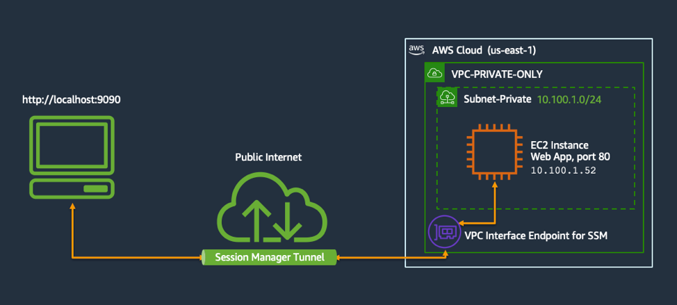

# Atun - AWS Tagged Tunnel
[](https://github.com/AutomationD/atun/actions/workflows/tests.yml)

``Secure tunneling doesn't have to be hard or annoying: `atun` is a tiny cli tool which works based on remote configuration. 
It uses tags to define hosts and ports forwarding endpoints. `atun.io/` [schema namespace](#tag-metadata-schema) is used to easily configure endpoints.
``
## Demo
### `atun up`


### `atun down`




> [!NOTE]  
> While the tool works, it is still in development and versions before 1.0.0 might have breaking changes.
Be ready that commits might be squashed/reset and tags might be rewritten until 1.0.0


## Quickstart
### Install with Homebrew
```bash
brew tap automationd/tap
brew install atun
```

### Install with Scoop
```PowerShell
scoop bucket add automationd https://github.com/automationd/scoop-bucket.git
scoop install atun
```

## Features
This tool allows to connect to private resources (RDS, Redis, etc) via routers.
### EC2 Router
This is the only router type available at the moment. It uses EC2 instances with `atun.io` schema tags to forward ports to the local machine.
It doesn't require a public IP, since it uses SSM.

## Tag Metadata Schema
In order for the tool to work your EC2 host must emply correct tag [schema](schemas/schema.json).
At the moment it has two types of tags: Atun Version and Atun Host.

- **Version** Tag Name = `atun.io/version`
- **Version** Tag Value = `<schema_version>`
- **Env** Tag Name = `atun.io/env`
- **Env** Tag Value = `<environment_name>`
- **Host** Tag Name = `atun.io/host/<hostname>`
- **Host** Tag Value = `{"local":"<local_port>","proto":"<protocol>","remote":<remote_port>}`

### endpoints config Description

- local: port that would be bound on a local machine (your computer)
- proto: protocol of forwarding (only `ssm` for now, but might be `k8s` or `cloudflare`)
- remote: port that is available on the internal network to the router host.

### Example
| AWS Tag                                                                        | Value                                           | Description                                                               |
|--------------------------------------------------------------------------------|-------------------------------------------------|---------------------------------------------------------------------------|
| `atun.io/version`                                                              | `1`                                             | Schema Version. It might change if significant changes would be intoduced |
| `atun.io/env`                                                                  | `dev`                                           | Specified environment of the router host                                 |
| `atun.io/host/nutcorp-api.cluster-xxxxxxxxxxxxxxx.us-east-1.rds.amazonaws.com` | `{"local":"23306","proto":"ssm","remote":3306}` | Describes endpoints config and how to forward ports for a MySQL RDS            |
| `atun.io/host/nutcorp.xxxxxx.0001.use0.cache.amazonaws.com`                    | `{"local":"26379","proto":"ssm","remote":6379}` | Describes endpoints config and how to forward ports for ElastiCache Redis      |

## Usage
There are two ways to use this tool: when an infra has a router with `atun.io` schema tags and when it doesn't have it yet.

### Manage Router Endpoints
Atun uses "routers" (such as EC2 routers) to establish secure connections to your infrastructure.

#### Create a Router
```shell
atun router create
```

#### List Available Routers
```shell
atun router ls
```

#### Connect to a Router
For troubleshooting or direct access:
```shell
atun router shell
```
A relevant protocol will be used, such as SSM.

#### Delete a Router
```shell
atun router delete
```

### Bring up a tunnel
This will bring up a tunnel via existing atun.io router
```shell
atun up
```

### Bring down a tunnel
```bash
atun down
```

### Check the status of the tunnel
```bash
atun status
```

### Create a router and connect in one go
```shell
atun up --create
```

### Bring down a tunnel and delete ad-hoc router
```shell
atun down --delete
```

## Development & Contributing
### Install from Homebrew (dev version)
```bash
brew tap automationd/tap
brew install atun --build-from-source
```
If the dev version has cached old metadata (b/c version is the same), use this command:
```shell
brew update && brew fetch --force atun && brew reinstall atun
```


## Roadmap
- [ ] Kubernetes (via annotations & ssh pod)
- [ ] AWS EC2 Instance connect
